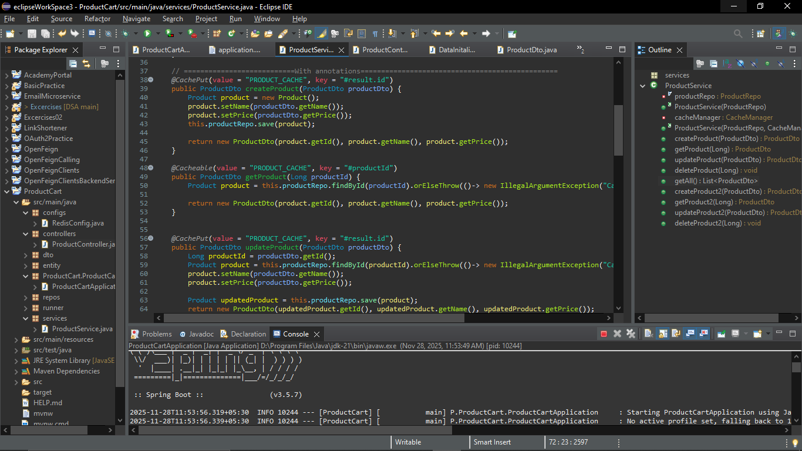
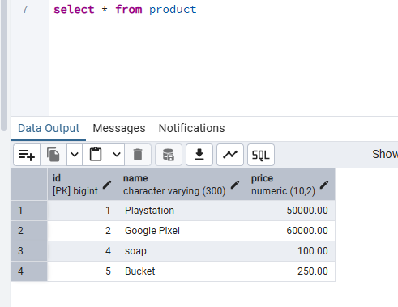
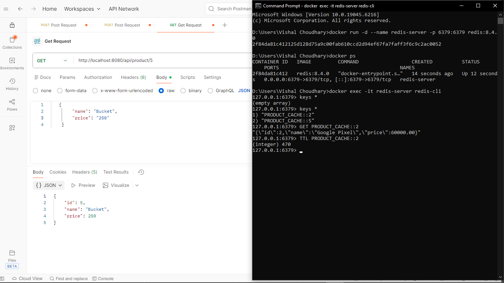
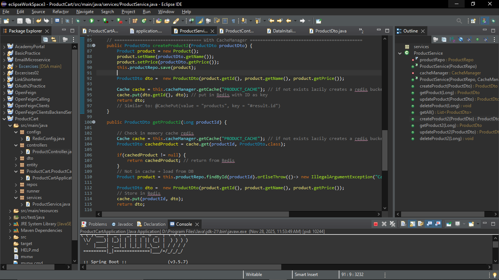

# Simple CRUD App with Redis Caching

This project is a **Spring Boot CRUD application** integrated with **Redis caching**. It demonstrates how to improve performance by caching data using Redis (running via Docker) and interacting with the API using Postman.

---

## 📌 Features

* Create, Read, Update, Delete (CRUD) operations for products.
* Redis caching for faster GET responses.
* Docker‑based Redis server.
* Spring Data JPA + Spring Cache abstraction.
* Postman testing examples.

---

## 🏗️ Project Structure

```
Simple-CRUD-App-with-Redis-Caching
│
├── src/main/java/... (Controllers, Services, Entities, Config)
├── images/ (project screenshots)
├── pom.xml
└── README.md
```

---

## 🚀 Running Redis with Docker

Use the following command to start Redis in Docker:

```bash
docker run -d --name redis-server -p 6379:6379 redis:8.4.0
```

Check running containers:

```bash
docker ps
```

Access Redis CLI:

```bash
docker exec -it redis-server redis-cli
```

---

## 📸 Project Screenshots

Below are screenshots included from the project's `/images` folder.

### 📂 GitHub Project Structure



### 🐳 Redis Docker + Postman GET Request



### 📥 POST Request



### ⚙️ Cache Manager and Redis Keys



---

## 🧰 Caching Methods Used

This project demonstrates **two different caching approaches** in Spring Boot:

### 1️⃣ Annotation-Based Caching

Spring’s cache abstraction is used with simple annotations:

* `@Cacheable` – caches method return values
* `@CacheEvict` – removes cache entries
* `@CachePut` – updates cache entries

These annotations make it easy to enable caching directly in service-layer methods.

### 2️⃣ CacheManager-Based Caching

For scenarios where more control is required, `CacheManager` is used programmatically:

* Manually accessing caches
* Storing or updating values
* Handling custom cache names

This gives more flexibility compared to annotation-based caching.

---

## 🧪 Testing the API with Postman

Example GET request:

```
GET http://localhost:8080/api/product/5
```

Sample response:

```json
{
  "id": 5,
  "name": "Bucket",
  "price": 250
}
```

Redis stores data as:

```
PRODUCT_CACHE::5
```

---

## 🧰 Technologies Used

* Java 17
* Spring Boot
* Spring Data JPA
* Spring Cache
* Redis
* Docker
* Postman

---

## 📄 License

This project is open-source and free to use.

---

Feel free to add more screenshots or extend the documentation as needed!
